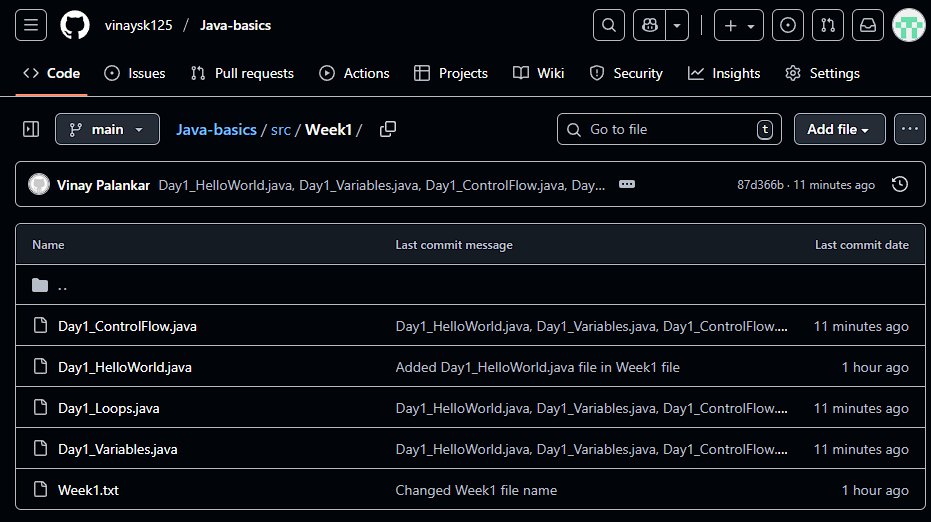

"Java repo setup
## Day 1: Java Basics
- Java program structure
- Variables, data types, literals
- Operators
- Type casting
- User input (Scanner)
- Conditionals (if-else, switch)

Program saved file name:
Calculation.java
GradeChecker.java
Main.java
Profile.java
TypeCastingDemo.java
UserProfileInput.java" 

Day 2: Loops & Arrays in Java
Day 2: Loops & Arrays
Loops

for loop → runs when number of iterations is known

while loop → runs until a condition becomes false

do-while loop → runs at least once before checking condition

break → exit loop early

continue → skip current iteration

Nested loops → loop inside another loop (used in patterns, tables)

Examples practiced:

Counting 1 to 10

Even numbers between 1–20

Multiplication table (user input)

Simple patterns with *

Arrays

Definition: Collection of elements of the same type stored in contiguous memory

Declaring: int[] arr = new int[5];

Initializing: int[] arr = {1, 2, 3};

Access via index: arr[0]

Enhanced for loop → for(int num : arr) (reads each element directly)

Examples practiced:

Take 5 integers from user → print sum & average

Find largest and smallest element from array

Day 3: Solved 5 HackerRank problems on Loops & Arrays

- ReverseArray
- Hackerrank_JavaLoops_1
- Hackerrank_Java_1D_Array
- Hackerrank_Java_Subarray
- Hackerrank_Arrays_DS
- Hackerrank_Java_Loops_2

Day 4: String concept and arrayString
Method/function parameter passing/argument.
Solved hackerrank problem.
Clearing concepts

Day4_RevisionBasics/ Performed revision programs

Day5_OOP1/ with these files (or your versions):

Dog.java, DogTest.java

Student.java, StudentTest.java, StudentService1.java, StudentServiceTest1.java

BankAccount.java, BankAccountTest.java

Rectangle.java, RectangleTest.java

# Week1 14 September 2025

Day1_HelloWorld.java, Day1_Variables.java, Day1_ControlFlow.java, Day1_Loops.java

# Java Basics - Vinay

This repository contains my **Java learning journey**, starting from basics to advanced concepts like Spring Boot and full-stack projects.  
Each week is structured with daily coding exercises, programs, and small projects.  

---

## 📂 Project Structure

java-basics-vinay/
│
├── src/
│ ├── Week1/
│ │ ├── Day1_HelloWorld.java
│ │ ├── Day1_Variables.java
│ │ ├── Day1_ControlFlow.java
│ │ ├── Day1_Loops.java
│ │ └── ...
│ ├── Week2/
│ ├── Week3/
│ └── ...
│
└── README.md

---

## 📅 Progress Tracker

### ✅ Week 1 – Java Basics + OOP (Day 1–7)

#### Day 1 – Java Basics
- [x] Hello World program  
- [x] Variables & Data Types  
- [x] Type Casting  
- [x] Temperature Converter (Celsius ↔ Fahrenheit)  
- [x] Control Flow (if-else, switch)  
- [x] Loops (for, while, do-while)  
- [x] Programs: Day1_HelloWorld.java, Day1_Variables.java, Day1_ControlFlow.java, Day1_Loops.java  

#### Day 2 – Classes & Objects  
- [ ] Student Class with constructor  
- [ ] Method Overloading practice  
- [ ] Object creation examples  

#### Day 3 – Inheritance & Polymorphism  
- [ ] Bank Account example  
- [ ] Animal → Dog, Cat hierarchy  

#### Day 4 – Abstraction & Interfaces  
- [ ] Abstract class: Shape → Circle, Rectangle  
- [ ] Interface: Vehicle → Car, Bike  

#### Day 5 – Exception Handling  
- [ ] Try-catch-finally examples  
- [ ] Custom Exception: InsufficientFundsException  

#### Day 6 – Collections Framework  
- [ ] ArrayList, HashSet, HashMap  
- [ ] Word frequency counter  

#### Day 7 – Mini Project  
- [ ] Library Management CLI app  

---

## 🛠 Tools Used
- **Java 17**  
- **IntelliJ IDEA**  
- **Git & GitHub**  
- **MySQL (for later weeks)**  

---

## 🚀 Goals
- Build **2 full-stack projects** using Java + Spring Boot + MySQL  
- Solve **DSA problems on LeetCode**  
- Transition into a **Backend Developer role** within 3 months  

---

✍️ *Maintained by Vinay as part of career transition journey.*

---

#### Day 2 – Classes & Objects  
- [x] Student Class with constructor  
- [x] Method Overloading practice  
- [x] Object creation examples 

- ✅ Student.java (class file) with fields, constructors, methods, overloading.
- ✅ Day2_ClassDemo.java (Main file) & Day2_MiniProgram.java working.

⏳ Hour – Created Mini Program
🔹 Task - StudentProgram.java (class file), StudentMiniProgram.java (Main file)
- Create 3 students.
- Print details & grades.
- Update marks for one student.
- Display updated grade.

---

#### Day 3 – Inheritance & Polymorphism  
- [x] Bank Account example  
- [x] Animal → Dog, Cat hierarchy  
- [x] Added Day3_OOP - Encapsulation, Inheritance, Polymorphism with School demo

---

#### Day 4 – Abstraction & Interfaces  
- [x] Abstract class: Shape → Circle, Rectangle  
- [x] Interface: Vehicle → Car, Bike 

Checkpoint Summary

By completing this section, you’ve mastered:

✅ extends keyword

✅ Method overriding

✅ Runtime polymorphism (dynamic dispatch)

✅ super() and constructor chaining

Week2 Day 5 — key takeaways (access rules, static usage, final patterns, inner classes)

--[x] Added Day4_OOP - Abstraction "and Interfaces with Banking demo

📘 In Word Notes (add this section):

Arrays – fixed size, indexed access, common methods

Strings – immutable, equals vs ==, substring, replace

StringBuilder – mutable, efficient for concatenation

Common interview problems done today
